<p align="center"></p>

# BooxUltimatum

**A home screen, sleep-screen designer, battery doctor and tweak hub for the BOOX Note Air6 C, in one app, without root.**

   

<p align="center">
  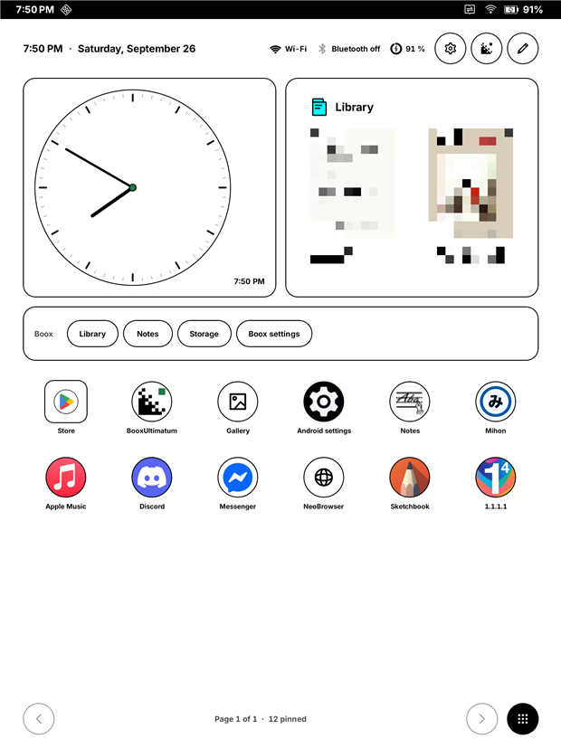
  &nbsp;
  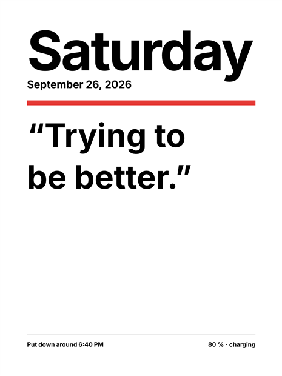
</p>

The Note Air6 C is a lovely tablet with a frustrating side. Independent reviews such as [eWritable's](https://ewritable.net/brands/boox/tablets/boox-note-air6-c/) praise the screen and the pen, then point at the same two things owners complain about: battery life, and software that scatters useful settings across a dozen places. BooxUltimatum is one owner's attempt to fix that from the inside. It isn't a skin over the problem. Every change it makes is measured on the real tablet, explained in plain words, and one tap away from being undone.

It's a single APK. Nothing is flashed, and the bootloader stays locked.

> **Status: pre-release.** It runs daily on the author's own tablet (Note Air6 C, firmware 4.3, Android 16), and nowhere else yet. The first public build is planned as 0.4 (see [Roadmap](#roadmap)). Until then, build it from source.

## What it does

### A home screen made for e-ink

<p align="center">
  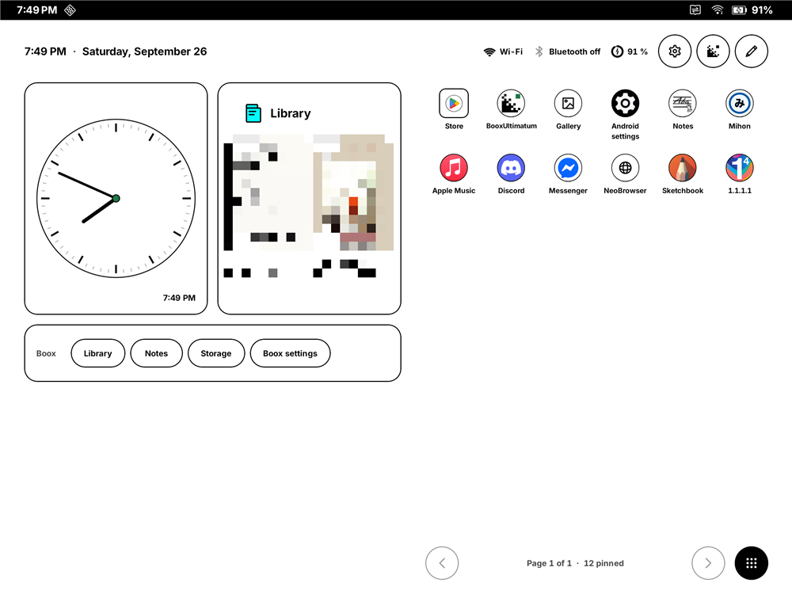
</p>

A calm, paper-white launcher that uses about a third of the Boox home's memory and no CPU when idle.

- **Widgets:** clock, month, agenda, weather, battery, next alarm, a note, a Boox shelf (Library, Notes, Storage) and any app's widget, including Boox's own. Library covers are pixelated in these screenshots.
- **Apps:** paged grids you turn with a swipe, folders, and icon shapes that remove the frame Boox draws into its own icons.
- **The header:** time, network, Bluetooth and battery in 8 Wi-Fi and 8 battery designs, plus keys for Boox Settings and BooxUltimatum.
- **All apps:** includes the Boox functions that have no launcher icon, sorted by name, colour or recent use.
- **Layout:** two panes in landscape. Nothing ever reflows while you type.

<p align="center">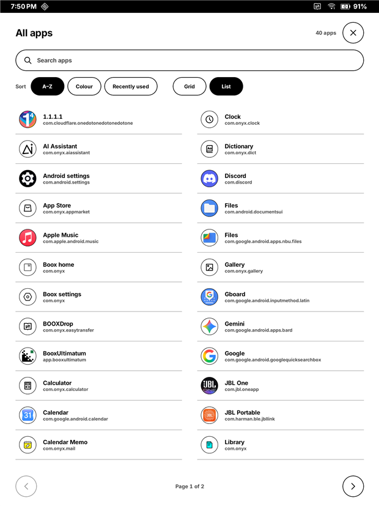</p>

### Your own sleep screen

<p align="center">
  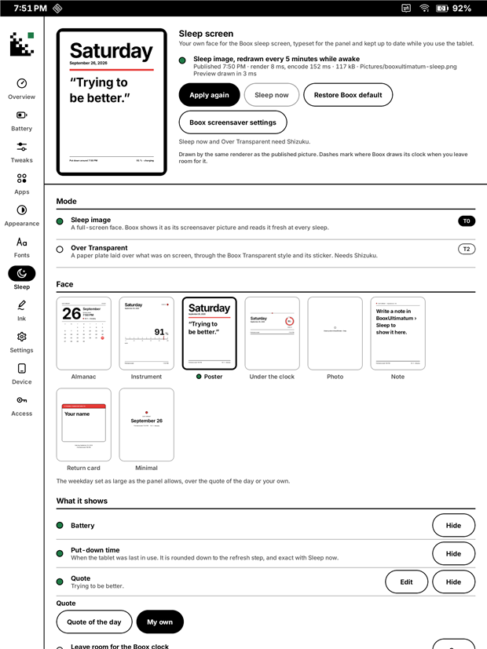
  &nbsp;
  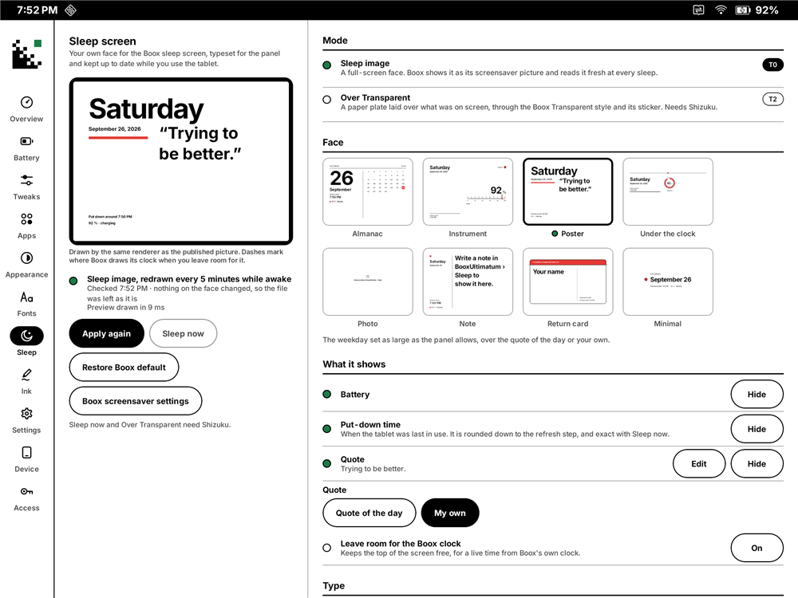
</p>

Boox gives you six preset screensavers. BooxUltimatum gives you eight faces set in *your* tablet font: Almanac, Instrument, Poster, Under the clock, Photo, Note, Return card and Minimal. Each has its own portrait and landscape layout.

- **Freshness:** Boox only reads the picture as the tablet goes to sleep, so the studio quietly redraws it while you use the tablet. It updates every 5 minutes by default, and whenever the battery, date or rotation changes. The time it shows is honest: "put down around 4:30 PM".
- **Rotation:** both orientations are kept ready, so turning the tablet never leaves you with a cropped face.
- **Keeping the Transparent style:** an *Over Transparent* mode lays a small paper plate over it instead.

### Instant ink for other apps (experimental)

<p align="center">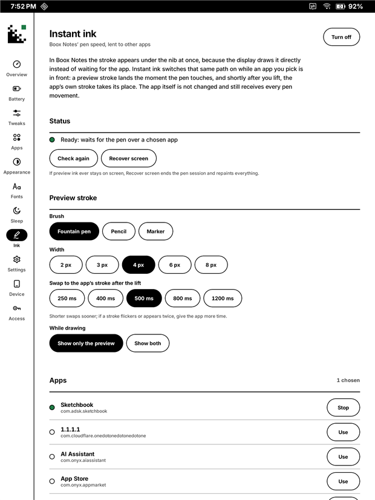</p>

In Boox Notes, ink appears under the nib in about 10 ms. In Sketchbook and most other apps, it trails behind. BooxUltimatum found how Notes does it (the display system draws the stroke straight from the pen) and lends that path to apps you choose.

A preview stroke lands at once, and half a second after you lift, the app's own brush takes its place. The app isn't modified in any way. It needs no root and no Shizuku. This is new and still being tuned; see [Known limits](#known-limits).

### A battery doctor that doesn't drain the battery

<p align="center">
  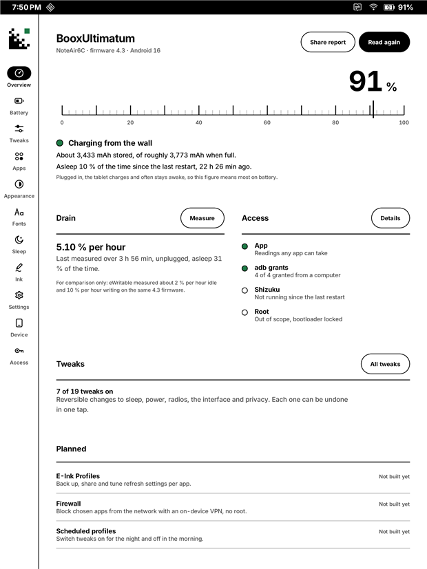
  &nbsp;
  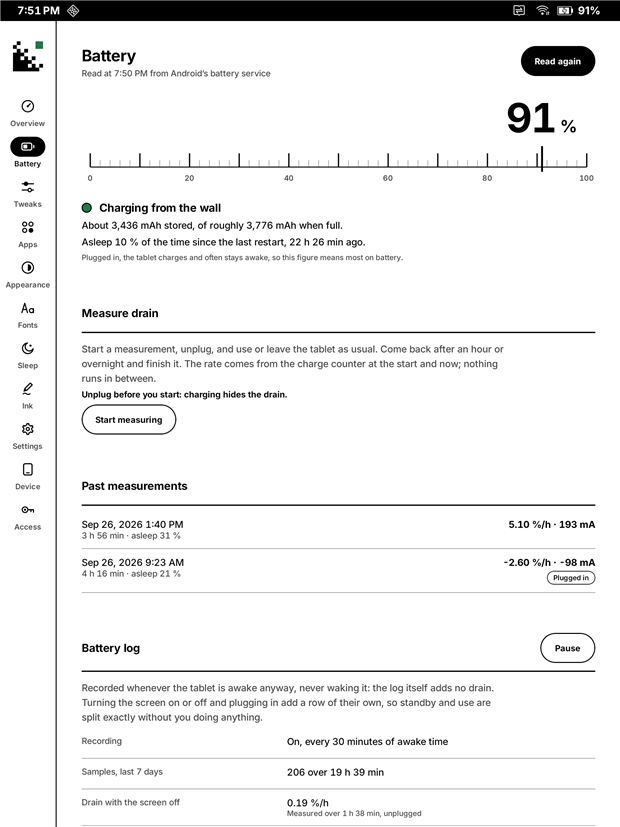
</p>

- **Measure drain:** unplug, use the tablet, and read the rate. The time-left estimate comes from real mAh, not guesses.
- **Battery log:** runs without ever waking the tablet, logging every screen, plug and level change, with a chart and a one-zip export.
- **Findings so far on this tablet:** standby is already excellent (0–12 mA), and screen-on use is where the battery goes, mostly because background downloads, music and chat apps keep the processor awake. The tweaks aim at exactly that.

### Tweaks you can undo

<p align="center">
  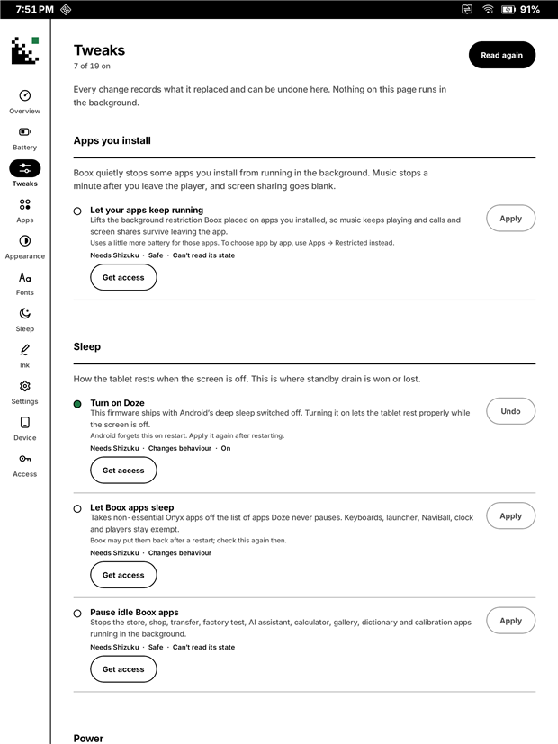
  &nbsp;
  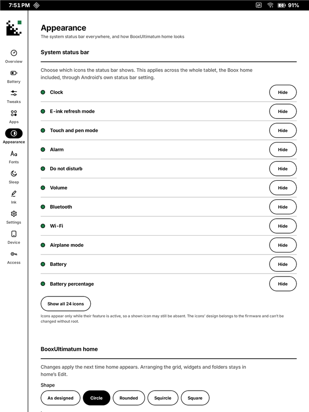
</p>

There are 19 reversible tweaks across apps, sleep, power, radios, interface and privacy. Every one records what it replaced, and *Undo* puts it back. Some examples:

- **Let your apps keep running.** Boox background-restricts every app you install, which is why music stops a minute after you leave the player.
- **Let Boox apps sleep**, **Turn on Doze**, and **Pause idle Boox apps**.
- **Status bar icons**, tablet-wide.
- **The whole tablet's font**, at a proper weight, without root.

<p align="center">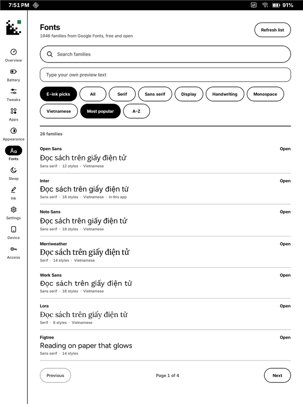</p>

A full **Google Fonts browser** (1946 families, with a Vietnamese filter) installs fonts for the tablet, NeoReader, the home screen or the app.

## How much access it needs

Every feature declares the least access it needs, and the app stays useful with none:

| Tier | What it is | What it unlocks |
|---|---|---|
| **T0** | Just the app | Home screen, sleep screen, Instant ink, battery measurement, fonts, the settings hub |
| **T1** | A few permissions granted once from a computer with `adb` | Reading battery statistics in the app, and changing system settings |
| **T2** | [Shizuku](https://shizuku.rikka.app), which runs a small service with the same rights as `adb` | Most tweaks, tablet-wide status bar icons, the network name in the header |
| T3 | Root | Out of scope. BooxUltimatum doesn't need or ask for it |

The one-off T1 grants are:

```text
adb shell pm grant app.booxultimatum android.permission.WRITE_SECURE_SETTINGS
adb shell pm grant app.booxultimatum android.permission.DUMP
adb shell pm grant app.booxultimatum android.permission.READ_LOGS
adb shell appops set app.booxultimatum GET_USAGE_STATS allow
```

Shizuku stops on every reboot. With the tablet plugged into a computer, `.\tools\host\start-shizuku.ps1` restarts it. Firmware 4.3 hides Wireless debugging, so restarting it without a computer isn't possible yet.

## Install

**From a release (planned for 0.4):** download the APK from this repository's Releases page, allow your browser or file manager to install apps, and open it. The Access page shows what each tier unlocks and the exact commands for it.

**From source (today):**

```powershell
# JDK 21 and the Android SDK (platform 36) are required.
$env:JAVA_HOME = 'C:\Program Files\Eclipse Adoptium\jdk-21.0.8.9-hotspot'
.\gradlew.bat assembleRelease                  # -> app\build\outputs\apk\release\app-release.apk
adb install -r app\build\outputs\apk\release\app-release.apk
```

Release builds from source are debug-signed for now, so they update an installed copy in place. Public releases will use a proper signing key.

### Using it as your home screen, and going back

Settings › Home screen › *Use this* makes BooxUltimatum the home screen. It first records the Boox home, so going back never loses anything:

- **On the tablet:** Settings › Home screen › *Back to Boox*. You can also tap *Notes* on the Boox shelf to use the Boox home for a moment.
- **From a computer**, if BooxUltimatum ever won't open: `adb shell cmd package set-home-activity --user 0 com.onyx/.StartupActivity`.
- **Without either:** Android Settings › Apps › Default apps › Home app › ONYX Launcher.

Recents, gestures, NaviBall and EinkWise belong to the system, so they behave the same under either home.

## Known limits

- **One tablet, one firmware.** Everything is verified on a Note Air6 C with firmware 4.3. Other Boox models are likely close but untested.
- **Undocumented interfaces.** The sleep screen, the tablet font and Instant ink work through undocumented Boox interfaces, found by reading how Boox's own apps do it. A firmware update can change them without notice. When something stops working, the app says so rather than guessing.
- **Instant ink is experimental:**
  - The preview is Boox's own black pen, so a coloured brush or the eraser only shows once the app's stroke takes over.
  - About one stroke in ten can lose the first millimetres of its preview.
  - It hasn't been tested with many apps yet.
- **The sleep screen can't tick while asleep.** Boox doesn't read the picture again until the tablet wakes. Boox's own clock overlay is the only thing that updates while asleep, and the studio can leave room for it.
- **Charging:** while the tablet charges, Boox always draws its battery bar over the sleep screen.

## Privacy

There are no accounts, analytics, ads or trackers. The app goes online for two things only: weather from [Open-Meteo](https://open-meteo.com) (the city you type), and fonts from Google Fonts when you open the browser. The battery log stays on the tablet until you choose to share it.

## Disclaimer

BooxUltimatum is an independent project. It is not affiliated with, endorsed by or supported by Onyx International or BOOX. "BOOX", "Note Air" and related names are trademarks of their owners, used here only to say which device this is for.

The app changes system settings, and, if you ask it to, the home screen, the sleep screen and how other apps draw. Every change is recorded and reversible, and nothing touches the system partitions or the bootloader. Still, this is pre-release software that relies on undocumented behaviour: **use it at your own risk**. As the GPL says, it comes with no warranty (sections 15 and 16 of `LICENSE`).

## Roadmap

No dates promised; this is a spare-time project, and each release ships when it works on the tablet.

- **0.4, first public preview (next)**
  - Instant ink checked with a real pen in several apps.
  - A release-signed APK on GitHub Releases.
  - A first-run guide for the adb grants and Shizuku.
  - A week of daily use without crashes.
- **0.5, battery**
  - A one-tap reading mode: Wi-Fi and Bluetooth off, Battery Saver on and sync paused, all undone together.
  - The first overnight and A/B results shown in the app.
  - Round trips recorded for the last three unverified tweaks.
- **0.6, home and sleep polish**
  - Notification dots (opt-in).
  - Front-light and refresh-mode quick actions.
  - Backing up and restoring the layout.
  - Agenda events on the sleep screen, and more faces.
- **1.0**
  - Confirmed on at least one more Boox model.
  - A Vietnamese translation.
  - Reproducible release builds.

The full, dated history is in [`CHANGELOG.md`](CHANGELOG.md).

## How it's built

Kotlin and Jetpack Compose, minSdk 30, target 36. The look is a "Braun Instrument" design language: paper white, black ink, one green lamp, the Archivo typeface, and no animation, because e-ink punishes motion. Every device fact the app relies on is written down with its evidence in [`knowledge/experiments.md`](knowledge/experiments.md). The design docs in [`docs/`](docs) explain the research, the architecture, the launcher and the sleep screen.

It is written by an owner of the tablet working with an AI pair programmer (GitHub Copilot). Every change is tested on the tablet before it's committed.

| Path | What's there |
|---|---|
| `app/` | The Android app. `core/` holds system readers, tweaks, the battery log, `sleep/` and `ink/`. `launcher/` is the home screen and `ui/` the screens |
| `docs/` | Numbered design docs (`00` device research to `06` sleep screen), plus the screenshots |
| `knowledge/` | The evidence log (`experiments.md`) and the Onyx package knowledge base bundled with the app |
| `tools/host/` | PowerShell scripts run from a computer over adb (recon, battery logger, Shizuku start) |
| `tools/dev/` | Repository hygiene (`prose_wrap.py`) |
| `AGENTS.md` | The rules for anyone, human or AI, working in this repo |

## Contributing

Bug reports and findings from other Boox models are the most useful contributions right now. For a finding, include your model, firmware version and what you measured. Before sending code, read [`CONTRIBUTING.md`](CONTRIBUTING.md) and [`AGENTS.md`](AGENTS.md). In short: every tweak must be reversible and declare its access tier, device facts need evidence, and prose is never hard-wrapped.

## License

BooxUltimatum is free software under the **GNU General Public License v3.0 or later** (see [`LICENSE`](LICENSE)). You may use, study, share and change it; if you distribute a changed version, you share its source under the same terms. Third-party code and assets, and their licenses, are listed in [`THIRD_PARTY.md`](THIRD_PARTY.md).
