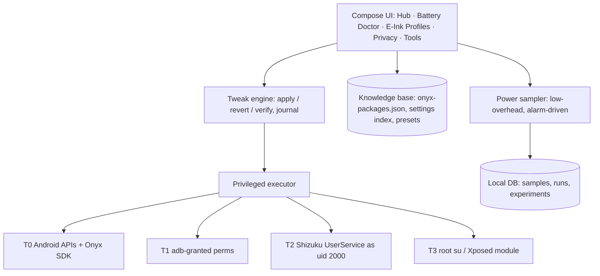

# 03 · Architecture

## Shape

One APK (`app.booxultimatum`), Kotlin + Jetpack Compose, minSdk 30, target/compile SDK 36 (Android 16). The UI is e-ink-first: monochrome, no ripples or animations, large targets, and pagination instead of scrolling where practical.



## Planned modules (single `:app` for now; split when the code grows)

| Module | Responsibility | Upstream it may borrow from |
|---|---|---|
| `:core-exec` | Privilege tier detection; `ShellExecutor` for T1/T2/T3 with a unified result type | Shizuku API (Apache-2.0), Canta's Shizuku usage (LGPL-3.0), Hail's freeze backends (GPL-3.0) |
| `:core-onyx` | Onyx SDK wrapper (EPD refresh, front light), MMKV `/onyxconfig` reader/writer, Onyx intents and hidden activities | onyx-intl/OnyxAndroidDemo (Apache-2.0), OnyxMMKVEditor (GPL-3.0), OnyxTweaks (GPL-3.0) |
| `:feature-battery` | Sampler, drain table, attribution parsers (batterystats checkin, power, alarm, jobs) | Battery Historian formats (reference only) |
| `:feature-debloat` | Knowledge-base driven profiles, reversible disable/uninstall | UAD-ng list schema (GPL-3.0), Canta |
| `:feature-privacy` | Local VPN DNS filter (no root), iptables (root) | NetGuard (GPL-3.0), AFWall+ (GPL-3.0) as references |
| `:feature-hub` | Searchable settings index with deep links | OnyxTweaks' shortcut list |
| `:xposed` (later, T3) | Android 16 port of selected OnyxTweaks hooks (per-activity refresh) | OnyxTweaks (GPL-3.0) |

## The tweak model

```kotlin
interface Tweak {
    val id: String                // "doze.remove-onyx-whitelist"
    val tier: Tier                // T0..T3
    val risk: Risk                // SAFE, CAUTION, EXPERT
    val evidence: String?         // link to knowledge/experiments.md entry
    suspend fun isApplied(): Boolean
    suspend fun apply(): Result<Unit>
    suspend fun revert(): Result<Unit>
}
```

Each apply writes a journal entry with the previous state, so reverting works even after an app reinstall (the journal is exported to shared storage).

## As built (0.2.0)

Still a single `:app` module, organised by package:

| Package | Holds |
|---|---|
| `core` | Platform readers (battery, device, packages, privilege status), `SystemSettings`, `SystemState` parsers (Doze, allowlist, appops, standby buckets, alarm wakeups, wakelocks), the `Journal`, `BatteryLog`, `StatusBar`, `Launchers`, `Fonts`, `AppWork` (an app-wide scope for changes that must outlive their screen) |
| `core.exec` | `Privileged`: the Shizuku user service (`ShellService`, AIDL `IShellService`) running as the shell uid, released after 45 s idle; `Diagnostics` for `dumpsys` with or without Shizuku |
| `core.tweaks` | The tweak framework and the catalogue of 19 tweaks |
| `ui` | Theme ("Braun Instrument"), components, glyphs, and one file per destination under `ui/screens` |
| `launcher` | The home screen: catalogue and preferences, activity and model, UI, widgets, status glyphs |

## Power sampler design (must not cause the drain it measures)

- No foreground service and no partial wakelock. The battery log uses `AlarmManager.setInexactRepeating` on `ELAPSED_REALTIME` (not the wakeup variant) every 30 minutes, so it only fires when the tablet is already awake and adds no wakeups. The alarm is set only when absent, because re-setting it restarts the countdown; boot and app updates set it afresh.
- Each light sample reads `BatteryManager` (capacity, `CHARGE_COUNTER`), sticky `ACTION_BATTERY_CHANGED` (voltage, temperature, plugged), `PowerManager.isInteractive`, and elapsed realtime and uptime. The first sample after a wake shows what the tablet lost while asleep: between two samples, 1 − Δuptime/Δelapsed is the share of time suspended. Opening the app adds a sample at most every 10 minutes.
- Every 3 hours a deep snapshot adds Doze state, alarm wakeups by app and held wakelocks. Files are CSV and JSONL in `Android/data/app.booxultimatum/files/logs`, pruned after 60 days, and shared as one zip with a README.
- For lab runs we still prefer the host-launched shell logger (`tools/host/power-logger.ps1`) because it involves zero app code.
