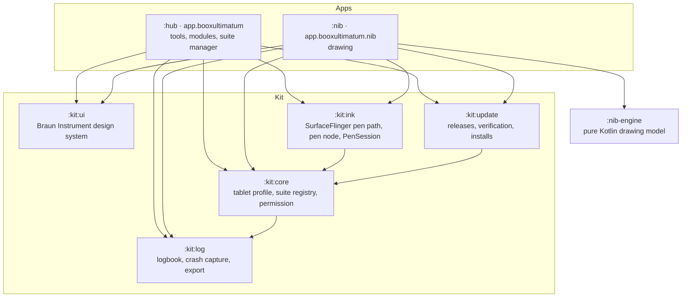

# 07 · The suite: hub, kit and apps

BooxUltimatum is no longer one app. It's a suite: a hub that holds the tools and modules, separate apps that build on the same foundations, and a kit of libraries they all share. This document describes how it's put together. The drawing app, Nib, has its own document ([`08-nib.md`](08-nib.md)).

## The pieces

| Module | Package | What it holds |
|---|---|---|
| `:hub` | `app.booxultimatum` | The hub app. Its application id and data stayed the same through the split, so installed copies update in place. |
| `:nib` | `app.booxultimatum.nib` | Nib, the drawing app |
| `:nib-engine` | `app.booxultimatum.nib.engine` | Nib's strokes, brushes, layers, undo and file format, with no Android code, so it's tested on the JVM |
| `:kit:core` | `app.booxultimatum.kit.core` | `Tablet` (the tablet profile), `SuiteApp` and `Suite` (the registry, certificates, open and uninstall), `AppWork`, `PenNodes`. Its manifest declares the suite permission and package visibility for every app. |
| `:kit:log` | `app.booxultimatum.kit.log` | `Logbook`, `Logger`, crash and exit capture, the log provider other suite apps read from, `Redact` |
| `:kit:ui` | `app.booxultimatum.kit.ui` | The theme, components and glyphs, the Archivo font and its licence |
| `:kit:ink` | `app.booxultimatum.kit.ink` | `SurfaceInk` (the display calls), `PenInput` (the pen's kernel node), `PenDisplay` and `PenSession` (a session for an app drawing in its own window) |
| `:kit:update` | `app.booxultimatum.kit.update` | `Version`, `ReleaseFeed`, `Updates` (check, download, verify, install), `UpdateText` |

The kit never depends on an app, and apps never depend on each other. The hub's Shizuku support stays in the hub: `SurfaceInk.connect` takes an optional `ElevatedRoute`, which Instant ink supplies and Nib doesn't need.

## Apps and modules

The hub's Suite page shows two kinds of parts.

- **Apps** are separate APKs, such as Nib. The hub installs them from GitHub Releases with the same checks as its own updates, opens them, updates them and uninstalls them (Android shows its own confirmation). Each works on its own; the hub only adds updates, one log export and the Suite page.
- **Modules** are built into the hub: Home screen, Sleep screen, Instant ink and the Battery log. Removing one stops its work and undoes what it changed, through the same steps as its own switches (`core/suite/Modules.kt`), and its pages leave the menu. Adding it back restores the pages, with the feature itself still off until it's turned on.

| Module | Removing it |
|---|---|
| Home screen | Hands the home back to Boox (with Shizuku; otherwise it refuses and says why), then disables the home alias |
| Sleep screen | Stops updates while asleep and the refresh alarm, turns its accessibility service off, and gives the sleep and power-off screens back to Boox |
| Instant ink | Turns it off, recovers the screen, and disables its Quick Settings tile |
| Battery log | Stops recording; past logs stay |

Instant ink treats suite apps like Boox's own apps: it pauses over them and never ends a session there, since Nib runs the pen path itself. Suite apps can't be picked for Instant ink.

## Navigation

The rail has five sections, and a section with several pages shows them as tabs. Pages keep their names, so `MainActivity.EXTRA_DESTINATION` links from the home screen, the Quick Settings tile and notifications still work.

| Section | Pages |
|---|---|
| Overview | Overview |
| Suite | Apps and modules, Home screen, Sleep, Ink |
| Battery | Battery |
| System | Tweaks, Apps, Appearance, Fonts, Settings |
| Device | Device (this tablet and this app's updates), Access, Logs |

## Trust between the apps

Every public build of every suite app is signed with the same release key. `:kit:core`'s manifest declares `app.booxultimatum.permission.SUITE` as a signature permission in every app, so no other app can claim the name first, and only apps signed with that key hold it. It guards each app's log provider. A consequence: a debug-signed suite app can't be installed next to a release-signed one, since Android refuses a permission declared by apps with different keys.

An APK is installed only if its SHA-256 matches the release, its package is the expected one, it's newer than the installed copy and signed like it, and it's signed with the installing app's own key. Development builds are signed differently, so their updater stays off.

## Releases and the test channel

Each app has its own version and tag. `tools/dev/publish.ps1` builds, checks the signing certificate, writes the checksum and publishes.

| Kind | Tag | Asset |
|---|---|---|
| Hub release | `vX.Y.Z` | `BooxUltimatum-X.Y.Z.apk` |
| Nib release | `nib-vX.Y.Z` | `Nib-X.Y.Z.apk` |
| Test build | `test-<hub or nib>-X.Y.Z-test.N` | `test-BooxUltimatum-…apk` or `test-Nib-…apk` |

Each APK also gets a `.sha256` file and the R8 mapping file it was built with (zipped), so a crash from a release can be traced back to the source.

- **Test builds** are unfinished work published so the owner can check it on the tablet while away from the computer. They're offered only when *Offer test builds* is on (Device page), and a release always outranks its own test build (0.6.0-test.3 comes before 0.6.0).
- **Hubs from before the suite** (0.5.x) look only for `BooxUltimatum-<tag without v>.apk`, and read only the latest 10 releases. So they never see a test build or a Nib release, but a run of more than ten such releases in a row could hide a hub release from them. The new updater reads 50.

## Logging

Every suite app writes a logbook in every build, release or debug (`:kit:log`).

- **What's recorded.**
  - Each entry is one JSON line: time, level, category, message, fields, thread, process and a per-launch session id. Each file starts with a header that names the app, its version and the tablet.
  - Crashes are written at once, with the last 200 entries.
  - At the next start, Android's record of why the process ended (a crash, an ANR, low memory, a force-stop) is logged, with the ANR trace or native tombstone saved beside it.
- **What it costs.**
  - Calls never wait for the disk. One writer thread batches the entries, and the queue drops routine entries first if it ever fills.
  - The pen path logs one summary per stroke, never per sample.
- **Levels.** Info and above always reach the file, and so does Debug for `ink`, `nib.pen`, `nib.render`, `update` and `suite`. *Detailed logging* (Device › Logs) raises every suite app to Verbose for 24 hours.
- **Where it's kept.** `noBackupFilesDir/logs/`, eight files of 1 MB at most, and nothing older than 14 days.
- **Privacy.** No drawing content, typed text, or account or network names. File names are hashed, and package names are kept only for suite and Boox apps.
- **Sharing.** Device › Logs › *Share logs* makes one zip with the hub's logs, every other suite app's logs (read through its provider) and a device summary. Problem reports quote the latest entries.

## Testing without the tablet

- **Unit tests** run on the JVM: `.\gradlew.bat testDebugUnitTest :nib-engine:test`. They cover the logbook, release parsing and version order (including what a 0.5 hub would see), the pen session's display calls against a fake display, and the whole drawing engine.
- **An emulator** shaped like the Note Air6 C runs the UI in both orientations: 1860 × 2480 at 300 dpi, Android 36, created as the `NoteAir6C` AVD. It has no Boox firmware, so Sleep and Ink are hidden there and Nib draws without the display preview.
- **The display's pen path needs the real tablet.** Test builds go out on the test channel, and the owner sends back the log export.
