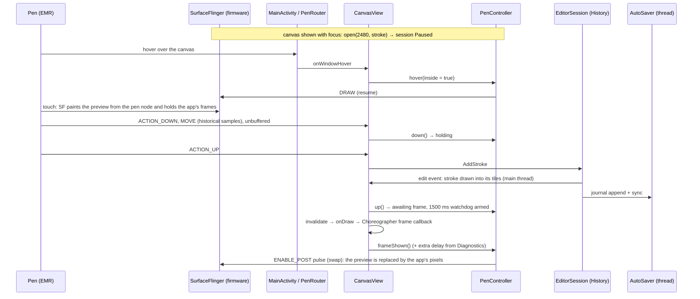

# 08 · Nib: the drawing app

Nib (`:nib`, package `app.booxultimatum.nib`) is the suite's drawing app for BOOX tablets, built on the pure-Kotlin engine in `:nib-engine` and the kit libraries (see [`07-suite.md`](07-suite.md)). Its aim is Boox Notes' instant pen with a familiar, Notes-like interface, but with many more brushes, very thin widths and unlimited layers. This document describes Nib 0.1 as built.

Nothing about Nib's use of the display's pen preview has been seen on the tablet yet *[verify]*. Everything in this document about the preview follows the firmware behaviour verified with Instant ink (`knowledge/experiments.md`, the `boox-firmware-interfaces` skill), and Nib's own Diagnostics page exists to check it. On the emulator and on tablets without the pen path, Nib is a software-only drawing app, and that mode is what the automated tests cover.

## The pieces

| Area | Files (under `nib/src/main/java/app/booxultimatum/nib/`) | What they do |
|---|---|---|
| Shell | `NibApplication`, `MainActivity`, `NibSettings` | Logbook start, the one activity (it handles rotation itself and sees every pen event first), the switches |
| Pen session | `pen/PenController`, `pen/NibPen` (with `PenRouter`), `pen/PressureNormalizer`, `pen/PenRecorderStore` | Nib's policy over `kit:ink`'s `PenSession`, the window-level pen router, pressure scaling, the pen recorder |
| Canvas | `editor/CanvasView`, `editor/EditorSession`, `editor/ToolState`, `editor/OpenSessions`, `editor/MultiTapDetector` | Input, the view of the page, one open drawing with its history and autosave, the toolbar's state, multi-finger taps |
| Rendering | `render/CanvasSink`, `render/TileCache`, `render/TileLru`, `render/DabRecording`, `render/DocumentPainter` | The engine's `RenderSink` on an Android `Canvas`, per-layer tiles, their memory policy, per-tile dab replay, whole-page pictures |
| Files | `store/DrawingStore`, `store/AutoSaver`, `store/CompactionPolicy` | The library on disk, journaling and snapshots |
| Brushes | `brush/Presets` (presets, pressure presets, groups, preview policy), `brush/WidthSteps`, `brush/Palette` | What the pen panel offers |
| Screens | `ui/NibApp`, `ui/LibraryScreen`, `ui/EditorScreen`, `ui/PenPanel`, `ui/LayersPanel`, `ui/DiagnosticsScreen`, `ui/AboutScreen`, `ui/Widgets`, `ui/NibGlyphs`, `ui/Names` | Compose screens and panels in the kit's Braun Instrument look |
| Diagnostics | `diag/Probes`, `diag/ProbeView` | The probes and their banded pen surface |
| Export | `export/Exporter`, `export/LogShare` | PNG to the gallery and to other apps, the log zip |

## From pen to swapped frame

- **Opening.** The canvas opens the session (paused) once it's attached, the activity is resumed and the window has focus, and closes it on `ON_PAUSE` and when it leaves the screen. Only one session exists per process (`NibPen.session`); the canvas and the Diagnostics probes take turns with it.
- **Resuming and pausing.** `MainActivity` hands every stylus hover and touch to `PenRouter` before Compose sees it, so the pen hovering over the toolbar or a panel pauses the session even though the canvas never receives that hover. A hover exit pauses after 120 ms unless a touch follows (Android sends a hover exit just before each touch). A stylus touch outside the canvas lets frames through and pauses. The session is also blocked (paused, and hover doesn't resume it) while a panel or menu is over the canvas, during two-finger gestures, while the eraser tool is chosen, while the active layer is locked or hidden, and while the window lacks focus. The pen's eraser end or side button pauses it too.
- **Never mid-stroke.** Blocks and preview changes that arrive while the pen touches, or while a finished stroke still waits for its swap, are deferred until after the swap, since letting frames through mid-stroke would end the preview for that stroke.
- **Quick strokes.** A stroke that starts before the previous one was swapped keeps the frames held; one swap after its lift replaces both previews.
- **The watchdog.** If frames are still held 1500 ms after a lift, the controller swaps anyway and logs a warning.
- **Software-only.** When `open()` finds no route (the emulator, other tablets, a changed firmware), the session stays `Unavailable`, every call is a no-op, and the canvas draws the stroke under way itself on every move.

## Input

- Stylus events (tool type `STYLUS` or `ERASER`) go straight to the engine's `StrokeBuilder` in document pixels, historical samples included, with `requestUnbufferedDispatch` on the down. Tilt and orientation come from `AXIS_TILT` and `AXIS_ORIENTATION`.
- Pressure is divided by the stylus's `AXIS_PRESSURE` range maximum when Android reports one, and by `SurfaceInk.maxTouchPressure` for raw readings above 1 when it doesn't (`PressureNormalizer`). A lift that reports zero pressure keeps the pressure before it, so strokes don't thin at their very end.
- The eraser end, the side button (`BUTTON_STYLUS_PRIMARY`) and the eraser tool erase with the chosen eraser.
- Palm rejection: fingers are ignored while the pen hovers over the canvas, while it draws, and for 600 ms after its last event.
- Fingers: two fingers pinch (`ScaleGestureDetector`) and pan together; one finger pans (a setting, on by default) or draws (a setting, off by default). Two fingers tapped together undo and three redo (`MultiTapDetector`: all down and up within 300 ms, moving less than 12 dp).

## Rendering and tiles

- `CanvasSink` is the engine's `RenderSink` on an Android `Canvas`: paths fill with the nonzero rule, groups are `saveLayer`s with the group's alpha and blend, dashes use `DashPathEffect`. Blends map to `BlendMode`: Normal to `SRC_OVER`, Multiply to `MULTIPLY` (the separable one, which paints over transparency too, unlike PorterDuff's), Erase to `DST_OUT`, Atop to `SRC_ATOP`.
- Dab textures are made once from a fixed hash: fine grain (fixed to the page) for the pencils, coarse broken grain (turned with each dab) for the charcoals, and a soft disc for the airbrush. A `PorterDuffColorFilter` in `SRC_IN` turns the white texture into ink of any colour.
- Each layer's strokes are rendered, without the layer's opacity or blend, into 256 px ARGB tiles at the current zoom level (the engine's `TileGrid.scaleBucket`, levels a factor of √2 apart). Tiles exist only where a stroke's ink can reach (a segment test against the tile, not just the stroke's bounds); empty tiles cost nothing. Each frame composites the visible tiles of each visible layer; a translucent or non-normal layer (or the active one while a stroke is live) goes through a `saveLayer` with its opacity and blend.
- A committed stroke is drawn into each tile it reaches on the main thread, so it's in the very next frame: dab strokes (the pencils, charcoals and airbrush) are recorded once as their dabs and each tile replays only the dabs that land on it (`DabRecording`); other strokes are recorded once as a `Picture` and played into each tile. Anything else (undo, redo, removals, zoom, eviction) re-renders tiles from the vectors on one background thread, which also keeps a few blank tiles ready while idle; the old pixels, or the tiles of the previous zoom level clipped to the missing tile, stand in until the new ones arrive. Each tile carries a generation, so a render that finishes after an edit touched its tile is thrown away.
- Layer property changes (visibility, lock, opacity, blend, order) never touch the tiles: they apply when compositing.
- Memory: tiles off screen are dropped least recently used first once the total passes a third of the app's memory class (24 to 192 MB, `TileCache.budgetFor`). Tiles on screen are never dropped, so a view that needs more runs over the budget rather than going blank. Dropped bitmaps reach the reuse pool only at the next frame, since the frame that dropped them may still draw them.
- The pixel eraser previews exactly while it moves: the active layer is drawn into a `saveLayer` and the eraser stroke is drawn with `DST_OUT` on top. The stroke eraser previews by erasing the strokes it has hit the same way; the lasso shows its outline.

## Documents and autosave

- Files live in `filesDir/drawings/`: `<id>.nib` (the engine's snapshot format, with a 480 px thumbnail), `<id>.journal` (every edit since, as the engine's `Journal` records it) and `<id>.meta` (the name and page size, as a properties file).
- Every applied edit, undo and redo included, reaches one background thread in order, together with the document it produced, and is appended to the journal and synced there. The pen never waits for the disk.
- Compaction writes a fresh snapshot with a new token (atomically, through a temporary file) and starts an empty journal: every 50 edits, when the journal passes 8 MB, when the activity stops, and when the drawing is closed. If the app dies in between, replay skips the old journal by its token, since the snapshot already holds its edits.
- Opening reads the snapshot, replays the journal onto it (logging how many records applied and why replay stopped, including a cut-short tail), and reopens the journal for appending after the last intact record.
- A drawing stays open while its editor is anywhere on the back stack, so a visit to Diagnostics or About keeps the undo steps and the view of the page.
- Export flattens the page over its paper colour into a PNG, saved through MediaStore into `Pictures/Nib/`, or written to the cache and offered to other apps through the FileProvider (`${applicationId}.files`).

## Brushes and preview stand-ins

- The pen panel groups every non-eraser brush of the engine's `BrushCatalog`: Pens (fineliner, fountain, ballpoint, calligraphy, square pen, dashed), Pencils (pencil, graphite), Markers (marker, highlighter), Brushes (brush pen, neo brush, airbrush) and Textured (charcoal, coarse charcoal). Erasers are in their own panel: pixel, stroke and lasso.
- Widths come in fine steps at the thin end (0.5, 0.75, 1, 1.25, 1.5, 2, 2.5, 3, 4, 5, 6, 8, 10, 12, 16, 20, 28, 40, 56, 80 and up), clamped to each brush's range with both ends always offered.
- Pressure presets reshape the brush's own curve: Soft multiplies its exponent by 0.55, Firm by 1.8; brushes that ignore pressure say so.
- Colours: twelve swatches tuned for Kaleido 3 (black, dark grey, mid grey, white, red, orange, yellow, green, teal, blue, purple, brown) and a hue and lightness picker at a fixed, strong saturation.
- The toolbar holds four favourite presets (brush, width, pressure, colour), kept across launches.
- **Preview stand-ins.** Each brush names a firmware preview style. Until a style has been seen working on the tablet, the engine's verified fallback stands in (Fountain for most, Pencil for the charcoals), unless *Try unverified preview styles* is on; the pen panel says when that happens. Only Pencil, Fountain and Marker are verified today.

## Zoom

Zoom runs from 25 % to 1600 %, by pinching or from the zoom key (Fit page, 100 %, closer and further by √2). While a pinch is under way the tiles stay at the level it started at, drawn scaled; when it ends, the level follows the new scale and the tiles re-render. The display's preview width is `Preview.widthPx(brush width, scale)`, sent with `setStroke` 120 ms after the brush, colour or zoom settles, never mid-stroke, so the preview matches what the tiles will show. On rotation, and when the docked layers panel opens or closes, the document point at the centre of the view stays at the centre.

## The interface

- **Library:** a paged grid of drawings (thumbnail, name, when it last changed), with New (the panel's own page, 1860 × 2480 on the Note Air6 C; A4 at 300 ppi; a square) and each drawing's rename, duplicate and delete (a confirm key). Name fields sit at the top, where the keyboard can't cover them.
- **Editor:** a Notes-like toolbar (back, four pen slots, the eraser, undo, redo, layers, zoom and a menu with Export PNG, Share, Recover screen, Settings, Diagnostics and About). Tapping a slot selects it; tapping the selected one opens the pen panel. Panels are toggled, not animated.
- **Layers** dock beside the canvas in landscape and below it in portrait, so the pen can keep drawing while they're open: pages of layers top first, each with its active lamp, visibility and lock, and for the active one its opacity steps and up and down; below, rename, duplicate, merge down and delete. A merge that can't be exact (a translucent or blended layer, or one holding pixel erasers, per the engine's `MergeDown.isExact`) asks for a second tap first. Every change goes through the engine's `History`, so all of it undoes. There is no limit on the number of layers.
- The canvas is one Android view inside Compose, kept at the same place in the composition in both orientations, so rotating never recreates it; the activity handles every configuration change itself.

## Diagnostics probes

The Diagnostics page is for the owner to run on the tablet while away from the developer. Each probe logs a `nib.probe` event per stroke and per answer (*Looks right*, *Broken*, *Nothing drawn*), with the band, style, width, colour, delay, route and session state, so the answers come back with Share logs.

| Probe | Bands | The question |
|---|---|---|
| Status | none | The display route, its pressure range, the session state, the tablet and stylus; the *Try unverified preview styles* switch; the extra swap delay; the pen recorder |
| Styles | the eight firmware styles, 4 px black | Does each style preview as named, and swap cleanly? Only 0 to 2 are verified |
| Widths · fountain, Widths · pencil | 0.5, 0.75, 1, 1.5, 2 and 3 px | Which thin widths does the display draw cleanly? Sent raw, with no minimum or pencil stand-in |
| Colour | red, blue, green, 50 % grey, translucent black on fountain and on pencil | Does the preview show colour on Kaleido, and does translucency break it? |
| Swap delay | 0, 16, 50 and 120 ms of extra wait | Does any delay avoid flicker when the preview is replaced? |

Entering a band with the pen sends its preview stroke to the same session the canvas uses; after each lift the stroke is drawn in the band with a matching engine brush and swapped after the band's delay. The pen recorder, off by default and in memory only, keeps the raw samples of the last 50 strokes and shares them as a `.penrec` (the engine's `PenRecording`), to replay a stroke that looked wrong on the JVM.

## Logging

Nib logs through `kit:log` in every build. `nib.pen` has one summary per stroke (points, samples, duration, sample rate, pressure range, tool, brush and width, whether it was previewed, held and merged, the preview style and width, the commit time, the zoom and the swap delay), never one per sample. `nib.render` has tile batches (count, total and longest time, cache size) and commits; `nib.doc` has opening, replay, snapshots and compaction with sizes; `nib.ui` and `nib.probe` the rest. Drawing ids are hashed with `Redact.hash`; drawing names and contents are never logged.

## Verified and not

- Verified on the emulator (Android 16, 1860 × 2480 at 300 dpi, no Boox firmware): software-only drawing with live rendering, every brush and eraser, layers, undo and redo, autosave with replay and compaction, export, both orientations with the canvas kept, the pen hover routing, palm rejection and pinch zoom (instrumented tests), and the release build under R8.
- Not yet seen on the tablet *[verify]*: that the canvas's session previews strokes and the swap replaces them cleanly; how long the swap should wait after the frame; the unverified styles 3 to 7; the thinnest width the preview draws cleanly; colour and translucency in the preview on Kaleido; the pen's pressure range as Android reports it; commit and tile times on the tablet's own CPU.

## Known limits

- Committing a stroke blocks the main thread while it's drawn into its tiles. On the emulator's host, a fountain-pen line across the page (17 tiles) takes about 8 to 21 ms and a charcoal one about 50 ms, mostly spent rasterising the textured dabs; the tablet's CPU is likely several times slower *[verify]*. The display's preview hides the wait, but it delays the swap. Rendering long strokes off the main thread and swapping when their tiles are in would remove it.
- Many large layers full of ink can need more tile memory than the budget; the tiles on screen are kept regardless.
- A duplicated layer's textured strokes get new ids, and the engine seeds dab scatter by stroke id, so their grain differs slightly from the originals.
- The library's thumbnails are 480 px, so very thin lines look faint in them.
- Pages are fixed at creation; there is no crop, resize, lasso move or text yet.
- The pixel eraser's live preview erases in view pixels and the tiles re-render exactly after the lift, which can show as a small change on e-ink.

## Testing

- JVM unit tests (`.\gradlew.bat :nib:testDebugUnitTest`): width steps, the palette and its picker, presets and their text form, pressure presets, preview stand-ins, the tile LRU and reach test, per-tile dab replay, compaction scheduling, multi-finger taps, pressure scaling, the pen controller against a fake display and clock (hover, blocks, the swap after the frame and the delay, the watchdog, quick strokes, deferred preview changes), the probes, the library layout and routes.
- Instrumented tests on the `NoteAir6C` emulator (`.\gradlew.bat :nib:connectedDebugAndroidTest`): a stylus stroke into the canvas, the same through the window, undo and redo (with the two-finger tap), layers, erasers, the tiles showing and losing ink, save and reopen with and without compaction, rotation keeping the canvas, export, pinch and palm rejection, and pen hover routing.
- On the tablet: the Diagnostics probes, then Share logs from About; test builds go out on the suite's test channel.
