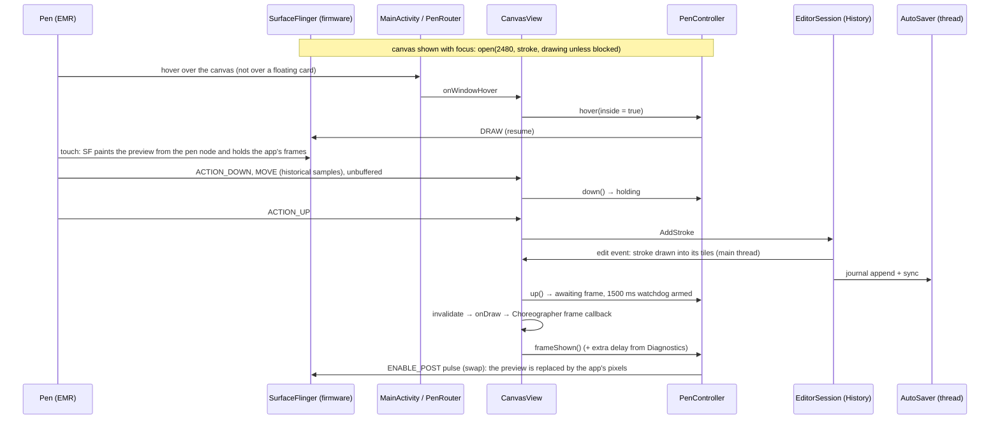

# 08 · Nib: the drawing app

Nib (`:nib`, package `app.booxultimatum.nib`) is the suite's drawing app for BOOX tablets, built on the pure-Kotlin engine in `:nib-engine` and the kit libraries (see [`07-suite.md`](07-suite.md)). Its aim is Boox Notes' instant pen with an interface at Sketchbook's level: many brushes, very thin widths, unlimited layers, and tools that float over a full-screen canvas. This document describes Nib as built after the redesign that followed 0.1; its visual world is recorded in [`DESIGN.md`](../DESIGN.md).

Nib's pen preview was tested on the owner's Note Air6 C (firmware 4.3) for 0.2.0: the preview, its width, the first stroke, the cards left out of the preview, and marker colours (`knowledge/experiments.md`, 2026-09-28). The rest of the preview follows the firmware behaviour verified with Instant ink (the `boox-firmware-interfaces` skill), and *Verified and not* below says what's still open. Nib's own Diagnostics page exists to check it. On the emulator and on tablets without the pen path, Nib is a software-only drawing app, and that mode is what the automated tests cover.

## The pieces

| Area | Files (under `nib/src/main/java/app/booxultimatum/nib/`) | What they do |
|---|---|---|
| Shell | `NibApplication`, `MainActivity`, `NibSettings` | Logbook start, the one activity (it handles rotation itself and sees every pen event first), the switches |
| Pen session | `pen/PenController`, `pen/NibPen` (with `PenRouter`), `pen/PenShields`, `pen/PreviewMatch`, `pen/PressureNormalizer`, `pen/PenRecorderStore` | Nib's policy over `kit:ink`'s `PenSession`, the window-level pen router, where the floating controls lie, the preview's size, pressure scaling, the pen recorder |
| Canvas | `editor/CanvasView`, `editor/EditorSession`, `editor/ToolState`, `editor/Selection`, `editor/StraightLine`, `editor/OpenSessions`, `editor/MultiTapDetector` | Input, the view of the page, one open drawing with its history and autosave, the rail's state, the lasso's selection and its math, the held straight line, multi-finger taps |
| Rendering | `render/CanvasSink`, `render/TileCache`, `render/TileLru`, `render/DabRecording`, `render/DocumentPainter`, `render/GuidesPainter` | The engine's `RenderSink` on an Android `Canvas`, per-layer tiles, their memory policy, per-tile dab replay, whole-page pictures, the paper's guides |
| Files | `store/DrawingStore`, `store/Paper`, `store/AutoSaver`, `store/CompactionPolicy` | The library on disk, a drawing's paper, journaling and snapshots |
| Brushes | `brush/Presets` (presets and their tuning, pressure presets, groups, preview policy), `brush/WidthSteps`, `brush/Palette` | What the pens hold |
| Design system | `ui/studio/Studio` (tokens and type), `Components`, `Sliders`, `FloatingPanel`, `PanelPlacement`, `Entry`, `Samples`, `StudioGlyphs`, `ValueScale` | Nib's cut-card world: slabs, keys, pills, sliders and their math, floating panels and their placement, the entry bar, engine-drawn pictures, the glyphs |
| Screens | `ui/NibApp`, `ui/LibraryScreen`, `ui/EditorScreen`, `ui/BrushPanels`, `ui/ColourPanel`, `ui/LayersPanel`, `ui/DocumentPanels`, `ui/SettingsScreen`, `ui/DiagnosticsScreen`, `ui/AboutScreen`, `ui/Screens`, `ui/Names` | The shelf, the editor and its floating panels, Settings, Diagnostics, About |
| Diagnostics | `diag/Probes`, `diag/ProbeView` | The probes and their banded pen surface |
| Export | `export/Exporter`, `export/LogShare` | PNG with or without paper and layer zips, to the gallery and to other apps, the log zip |

## From pen to swapped frame

- **Opening.** The canvas opens the session once it's attached, the activity is resumed and the window has focus, and closes it on `ON_PAUSE` and when it leaves the screen. It opens drawing, not paused, unless something blocks it: opening paused and resuming at the first hover lost the start of the very first stroke now and then on the tablet. Only one session exists per process (`NibPen.session`); the canvas and the Diagnostics probes take turns with it. While it's open, a lease file (`FileLease`, `pen-session.lease` in the no-backup folder) names the process: the display doesn't notice when that process dies, and a Nib killed mid-session (an update, a crash) left the preview drawing over every app. `NibApplication` calls `NibPen.start`, which ends a drawing session left by an earlier process.
- **Over the cards: exclusion, not pausing.** `MainActivity` hands every stylus hover and touch to `PenRouter` before Compose sees it. The floating controls (pills, the rail, the view chip, open panels, the entry bar, messages) record where they lie in `PenShields` as they are laid out, and the canvas counts those areas as not its own. With the pen over one, the session keeps drawing and the display is told to leave that card out of the preview (`PenSession.exclude`, screen coordinates; the display keeps one rectangle). Pausing there, as 0.1 did, sometimes lost the start of the next stroke on the canvas, since the resume came too late for a quick stroke. A pen touch outside the canvas excludes what it lands on and, at the lift, swaps (`touchOutsideEnded()`), so nothing held stays held. Back over the canvas the exclusion is cleared, and a pinned panel doesn't block the canvas around it. A hover exit no longer pauses. The session is blocked (paused, and hover doesn't resume it) while an unpinned panel, the menu or the entry bar is open (the pen's next touch closes them instead of drawing), during two-finger gestures, while a tool other than the pen is chosen (eraser, lasso, eyedropper, hand), while strokes are selected, while the active layer is locked or hidden, and while the window lacks focus. The pen's eraser end or side button pauses it too.
- **Never mid-stroke.** Blocks and preview changes that arrive while the pen touches, or while a finished stroke still waits for its swap, are deferred until after the swap, since letting frames through mid-stroke would end the preview for that stroke.
- **Quick strokes.** A stroke that starts before the previous one was swapped keeps the frames held; one swap after its lift replaces both previews.
- **The watchdog.** If frames are still held 1500 ms after a lift, the controller swaps anyway and logs a warning.
- **The preview's size.** The display draws its preview at the width it's sent, but Nib's brushes thin with pressure, so a preview sent at the full width looked wider than the stroke that replaced it (owner's report). `PreviewMatch` sends the brush's width at the owner's typical pressure (a slow average of each stroke's mean pressure), times a factor per preview style that the owner can tune in Diagnostics › Match preview. Each stroke's log has `p mean`, `typical p`, `size factor` and `since open ms`.
- **Software-only.** When `open()` finds no route (the emulator, other tablets, a changed firmware), the session stays `Unavailable`, every call is a no-op, and the canvas draws the stroke under way itself on every move.

## Input

- Stylus events (tool type `STYLUS` or `ERASER`) go straight to the engine's `StrokeBuilder` in document pixels, mapped through the view's zoom, pan and turn, historical samples included, with `requestUnbufferedDispatch` on the down. Tilt comes from `AXIS_TILT`; orientation from `AXIS_ORIENTATION`, less the page's turn, so a flat nib keeps its angle to the paper.
- Pressure is divided by the stylus's `AXIS_PRESSURE` range maximum when Android reports one, and by `SurfaceInk.maxTouchPressure` for raw readings above 1 when it doesn't (`PressureNormalizer`). A lift that reports zero pressure keeps the pressure before it, so strokes don't thin at their very end.
- **Tools.** The pen draws with the chosen slot. The eraser end, the side button and the eraser tool erase with the chosen eraser. The lasso draws a loop, then moves, scales and turns what it picked. The eyedropper takes the colour of the page under the pen (paper, guides and every visible layer, rendered from the vectors at that point) and hands back to the pen. The hand turns the page about the view's centre with the pen or one finger, snapping upright to 0°, 90°, 180° and 270° within 5°.
- **The straight line.** When the pen rests at a stroke's end for about 500 ms (within 6 dp), the stroke becomes a straight segment from where it began to where the pen is, and keeps following the pen until the lift; its pressure along the segment comes from the drawn path at the same fraction of its length (`StraightLine`). A resting pen keeps reporting, so the wait restarts only when the pen moves on. On the tablet the display previews the stroke as drawn and the straight line replaces it at the swap *[verify]*. It can be turned off in Settings.
- Palm rejection: fingers are ignored while the pen hovers over the canvas, while it draws or holds a tool, and for 600 ms after its last event.
- Fingers: two fingers pinch (`ScaleGestureDetector`), pan and twist together; the twist turns the page and snaps to a quarter turn within 5°. One finger pans (a setting, on by default) or draws (a setting, off by default), and with the lasso, eyedropper or hand it works that tool. Two fingers tapped together undo and three redo (`MultiTapDetector`).

## Rendering and tiles

- `CanvasSink` is the engine's `RenderSink` on an Android `Canvas`: paths fill with the nonzero rule, groups are `saveLayer`s with the group's alpha and blend, dashes use `DashPathEffect`. Blends map to `BlendMode`: Normal to `SRC_OVER`, Multiply to `MULTIPLY`, Erase to `DST_OUT`, Atop to `SRC_ATOP`.
- Each frame draws the desk (flat grey with a cutting-mat grid fixed to the screen), then the page as a turned rectangle with a 6 dp black shadow, its paper colour, and its guides under the layers.
- Each layer's strokes are rendered, without the layer's opacity or blend, into 256 px ARGB tiles at the current zoom level (the engine's `TileGrid.scaleBucket`). **Tiles stay upright in document space**: the view's mapping is split into an upright part (`Viewport.unrotated()`) that places the tiles and a turn (`Viewport.turn()`) applied to the canvas once, so a turned page costs no re-rendering and no tile ever has to be drawn at an angle. Tiles exist only where a stroke's ink can reach; each frame composites the visible tiles of each visible layer.
- A committed stroke is drawn into each tile it reaches on the main thread, so it's in the very next frame (dab strokes replay only their own dabs per tile, `DabRecording`). Edits the lasso makes (a move, scale or turn, a recolour, a duplicate, a deletion, a move to another layer) and the undo and redo of transforms re-render their tiles at once on the main thread too (`TileCache.renderNow`, at most 24 tiles; more go to the worker), so a moved selection never shows at its old place while the worker catches up. Anything else re-renders tiles from the vectors on one background thread.
- While a selection is dragged, its strokes are lifted out of the layer the way the stroke eraser previews (drawn with `DST_OUT` in the layer's group) and drawn where they are going.
- Layer property changes (visibility, lock, opacity, blend, order) never touch the tiles: they apply when compositing. Memory, eviction and the dab textures are as in 0.1: tiles off screen are dropped least recently used first past a third of the memory class, tiles on screen never are.

## Documents and autosave

- Files live in `filesDir/drawings/`: `<id>.nib` (the engine's snapshot format, with a 480 px thumbnail), `<id>.journal` (every edit since) and `<id>.meta` (a properties file: the name and page size as 0.1 wrote them, plus the layer count at the last snapshot and the paper: `paper.colour`, `paper.guides`, `paper.spacing`, `paper.export_guides`).
- The file format is unchanged from 0.1, and 0.1's drawings open as they were: a `.meta` without the new keys reads as plain white paper, and its layer count is read from the snapshot's manifest alone (`NibFile.readSummary`, which decodes no stroke).
- The paper lives beside the drawing rather than in the document, so changing it isn't an undo step and needs no new journal record.
- Journaling, compaction and replay are as in 0.1: every applied edit reaches one background thread in order and is appended and synced there; a fresh snapshot is written every 50 edits, past 8 MB of journal, when the activity stops and when the drawing is closed. Thumbnails draw every stroke at least 1.3 px wide, so thin lines stay visible on the shelf.
- A drawing stays open while its editor is anywhere on the back stack, so a visit to Settings, Diagnostics or About keeps the undo steps and the view of the page.
- **Export** (`ExportKind`): the page with its paper (and its guides, when *Show the guides in exports* is on), the ink alone on transparency, or each layer (hidden ones too) as its own transparent PNG in one zip. PNGs are saved through MediaStore into `Pictures/Nib/`, zips into `Download/Nib/`, or written to the cache and offered to other apps through the FileProvider.

## Brushes

- The Brushes panel shows every non-eraser brush of the engine's catalogue by family (Pens, Pencils, Markers, Brushes, Textured), each family drawn as its own tool down the panel's side. Each brush is a tile with a sample stroke the engine draws at the pen's width and colour (an S with the pressure rising and falling, rendered off the main thread through `CanvasSink` and cached, one document pixel to one screen pixel), its name, and the display style that previews it, marked ≈ when a verified style stands in.
- A pen (`BrushPreset`) is a brush, a width, a pressure preset, a colour and the owner's tuning (`BrushTune`): opacity, the pressure curve's exponent, floor and ceiling, smoothing, dab spacing, flow, grain and scatter, the nib's angle and whether it follows the pen, speed thinning and taper. Untuned pens are written in 0.1's text form; tuned ones add one field, and damaged values are skipped or clamped.
- **Brush settings** has three pages below a live sample that follows every control as it moves. Size and ink: width on a logarithmic track snapped to a quarter pixel at the thin end, with a dot drawn to scale at the current zoom, and opacity over a checkerboard; what the display previews and at what width, with a link to Match preview. Pressure: Soft, Medium and Firm as tiles showing their curve and a sample, then sensitivity (the exponent), the lightest touch (the floor) and the hardest press (the ceiling), with the curve plotted; a brush that ignores pressure can be made to follow it. Feel: smoothing with a before-and-after sample of a shaky line, texture (grain, spacing, density, scatter) for the dab brushes, a nib dial for calligraphy, the square pen and the highlighter, and speed and taper for the brush pens. Every slider has − and + keys and a value to type.
- Widths, pressure presets and preview stand-ins behave as in 0.1. Only Pencil, Fountain and Marker are verified preview styles today.
- **Marker colours.** The display's Marker style drops a translucent preview in any colour but grey or yellow (tested on the tablet). So the Marker style's colour goes through `MarkerPreview` (engine): *Solid colour*, the default, sends the colour opaque, which covers what's under the stroke until the swap; *See-through grey* sends a half-alpha grey as light as the colour, never lighter than #BBBBBB, the lightest seen showing. It's a choice in Settings › Display preview, and applies to the marker, highlighter and airbrush.
- **Colours**: a saturation and value square with a hue strip, the twelve swatches tuned for Kaleido 3, the eight colours used lately, a hex field, and the eyedropper.

## The view

Zoom runs from 25 % to 1600 % by pinching or from the View panel (Fit page, 100 %, closer and further by √2). The page turns by twisting two fingers, with the hand tool, or from the View panel (quarter turns or a typed angle), and snaps upright within 5°. The engine's `Viewport` holds the turn: `view = R(rotation) · (doc · scale) + offset`, with `rotateAround`, `rotatedTo`, `unrotated`, `turn` and `fit`, which stands the page upright again; quarter turns map exactly. The view chip reads "78 % · 12°"; Reset view fits the page and sets the turn to 0°. The display's preview width is `Preview.widthPx(brush width, scale)` through `PreviewMatch`, which a turn doesn't change. When the tablet rotates, a page that was fitted and left alone is fitted again; otherwise the document point at the centre stays at the centre.

## The interface

- **Library (the shelf):** the wordmark with the count, Settings, Diagnostics and About in a pill; a search field and an order (recent, name, size on disk); the New card first on the first page, opening page sizes drawn at their shape (this tablet's page in portrait and landscape, A4, A5, a square) and a custom size in pixels or millimetres at 300 ppi; drawings as cards with the thumbnail on its paper, the name, the date and the layer count, each with a menu (open, rename, duplicate, export, delete with a confirm); Choose several to export or delete together; an empty shelf with an illustration drawn by the engine itself. Paged, not scrolled.
- **Editor:** see [`DESIGN.md`](../DESIGN.md) › Layout for the first viewport. Tapping a pen slot chooses it; tapping the chosen one opens Brush settings; tapping the eraser again opens the eraser panel. Full screen hides everything but a small corner key.
- **Floating panels:** Brushes, Brush settings, Colour, Layers, Eraser, View, Export, Paper, Menu and Move to layer open as cards beside their key, can be dragged by their header and pinned, and remember where they were per orientation (`PanelMemory`). An unpinned panel closes when the pen or a finger touches the canvas, and the pen's touch that closes it doesn't draw.
- **Layers:** pages of layers, top first, each with a thumbnail the engine draws over a checkerboard, its name, visibility and lock; for the active one, rename, opacity on a slider, blend (Normal, Multiply, Clip, the engine's `Atop`), keep transparency (`alphaLock`), up and down, duplicate, merge down (a second tap when it can't be exact, per `MergeDown.isExact`) and delete (a second tap). Every change goes through the engine's `History`, so all of it undoes. There is no limit on the number of layers.
- **Lasso selection:** strokes of the active layer mostly inside the loop (`insideLasso`) are picked and framed with corner handles (scale about the opposite corner, uniformly) and a turn handle (about the frame's centre, snapping to 45° steps within 3°); dragging inside moves them. Each move, scale or turn is one `TransformStrokes` step; the frame turns with the strokes. The selection bar moves them to another layer (`MoveStrokes`), duplicates them (`InsertStrokes`, offset a little), gives them the pen's colour (`ReplaceStrokes`), deletes them (a second tap) or ends the selection. Undo and redo end it.
- **Paper:** white, warm, grey or black, and guides (none, dots, grid or lines) at a spacing from 20 to 400 px, drawn under the layers and never part of the ink.
- **Typed values** go in the entry bar at the top of the screen, where the keyboard can't cover it; the value is checked, clamped to its range and the owner told when it was. The keyboard never resizes the canvas.
- The canvas is one Android view inside Compose, kept at the same place in the composition in both orientations, so rotating never recreates it; the activity handles every configuration change itself. Panel changes never redraw the canvas.

## Diagnostics probes

The Diagnostics page is for the owner to run on the tablet while away from the developer. Each probe logs a `nib.probe` event per stroke and per answer, with the band, style, width, colour, delay, route and session state, so the answers come back with Share logs.

| Probe | Bands | The question |
|---|---|---|
| Status | none | The display route, its pressure range, the session state, the tablet and stylus; *Try unverified preview styles*; the extra swap delay; the pen recorder |
| Match preview | fountain pen 4 px, pencil 4 px, marker 16 px | Does the preview look as wide as the stroke that replaces it? Each style's preview size (×0.3 to ×1.6 in steps of 0.05, on a slider with − and + and a typed value), the typical pressure learnt so far, and *Learn again*; answers *Preview wider*, *Matches*, *Preview thinner* |
| Styles | the eight firmware styles, 4 px black, sized like the editor's | Does each style preview as named, and swap cleanly? Only 0 to 2 are verified |
| Widths · fountain, Widths · pencil | 0.5, 0.75, 1, 1.5, 2 and 3 px | Which thin widths does the display draw cleanly? |
| Colour | red, blue, green, 50 % grey, translucent black on fountain and on pencil | Does the preview show colour on Kaleido, and does translucency break it? |
| Marker colours | the marker style at 16 px: red at half alpha, opaque, blended with white, and as a grey; blue opaque and as a grey; mid and light grey at half alpha | Which ways of sending a colour does the marker style show? (Answered on the tablet: opaque colours and every grey, not translucent colours) |
| Swap delay | 0, 16, 50 and 120 ms of extra wait | Does any delay avoid flicker when the preview is replaced? |

In Match preview the bands' previews are sized through `PreviewMatch` exactly as the canvas sizes them; every size change is logged (`match factor`) and resent to the band the pen is in, and every answer is logged (`match answer`, with the preview width sent, the brush width, the factor and the typical pressure). Brush settings links to it. The pen recorder, off by default and in memory only, keeps the raw samples of the last 50 strokes and shares them as a `.penrec`.

## Logging

Nib logs through `kit:log` in every build. `nib.pen` has one summary per stroke (points, samples, duration, sample rate, pressure range and mean, tool, brush and width, whether it was previewed, held, merged or straightened, the preview style, width and size factor, the typical pressure, the commit time, the zoom and turn, the time since the session opened and the swap delay), never one per sample. `nib.render` has tile batches and commits, including renders done at once; `nib.doc` has opening, replay, snapshots, compaction, exports and paper changes; `nib.ui` has settings, selections, view resets and turns; `nib.probe` the rest. Drawing ids are hashed with `Redact.hash`; drawing names and contents are never logged.

## Verified and not

- Verified on the emulator (Android 16, 1860 × 2480 at 300 dpi, no Boox firmware): software-only drawing with live rendering, every brush and eraser, layers, undo and redo, autosave with replay and compaction, the three kinds of export, the turned page (drawing lands where the pen is), Reset view, lasso moves, duplicates and deletes with undo, typed values with clamping, the eyedropper, the held straight line, the pen over a floating card, a 0.1-style drawing opening, both orientations with the canvas kept, palm rejection and pinch zoom (instrumented tests), and the release build under R8.
- Verified on the tablet (Note Air6 C, FW 4.3, 0.2.0 test builds): the canvas's session previews strokes and the swap replaces them; the preview matches the stroke's width at ×1 in the Match preview bands (in daily drawing it can still look a little wider); the first stroke after opening is whole; the cards stay out of the preview and strokes next to them start whole; the Marker style's colours, above.
- Not yet seen on the tablet *[verify]*: that the lease and the home screen's check end a session a killed Nib left (unit-tested); how long the swap should wait; the unverified styles 3 to 7; the thinnest width the preview draws cleanly; colour in the other styles beyond Nib's blue pen; the pen's pressure range as Android reports it; commit, tile and at-once render times on the tablet's CPU; how the straight line looks when its drawn preview is replaced; how the cut-card chrome refreshes and ghosts on the panel.

## Known limits

- Committing a stroke, and editing a selection, blocks the main thread while their tiles are drawn. On the emulator's host a fountain-pen line across the page (17 tiles) takes about 8 to 21 ms and a charcoal one about 50 ms; the tablet's CPU is likely several times slower *[verify]*.
- The display keeps one excluded rectangle, so only the card under the pen is kept clear. A stroke started on the canvas and carried onto another card can leave preview ink on that card until the swap.
- The preview can look a little wider than the stroke in daily drawing, though it matched in the Match preview bands; Match preview tunes it per style.
- The straight line snaps under the pen only in software; on the tablet the drawn stroke stays in the preview until the swap.
- Many large layers full of ink can need more tile memory than the budget; the tiles on screen are kept regardless.
- A duplicated layer's or selection's textured strokes get new ids, and the engine seeds dab scatter by stroke id, so their grain differs slightly from the originals.
- The shelf's layer count is as of the drawing's last snapshot; edits journaled since show after the next one.
- Pages are fixed at creation; there is no crop, resize or text yet. Scaling a selection scales its brush widths too, beyond the brush's own range.
- The pixel eraser's live preview erases in view pixels and the tiles re-render exactly after the lift, which can show as a small change on e-ink.

## Testing

- JVM unit tests (`.\gradlew.bat :nib:testDebugUnitTest`): width steps, the palette, hex, HSV and recent colours, presets, their tuning and text forms, pressure presets, preview stand-ins and `PreviewMatch`, slider math (the log width track, snapping, stepping, typed values, percentages), panel placement and memory per orientation, lasso math (move, scale from a corner, turn with snapping, handle hits), the held straight line, the library's order, search and page sizes, the tile LRU and reach test, per-tile dab replay, compaction scheduling, multi-finger taps, pressure scaling, the pen controller against a fake display and clock, the probes, the view readouts and routes.
- Engine tests (`.\gradlew.bat :nib-engine:test`) add the turned `Viewport` (round trips at many angles, quarter turns exact, turning about a focus, zoom and pan on a turned page, fit standing the page upright, the upright frame times the turn, the visible area, snapping) and the manifest-only summary and thumbnail.
- Instrumented tests on the `NoteAir6C` emulator (`.\gradlew.bat :nib:connectedDebugAndroidTest`): 0.1's twelve (a stroke into the canvas and through the window, undo and redo, layers, erasers, tiles, save and reopen, rotation keeping the canvas, export, pinch and palm rejection, pen hover, the recorder) and `StudioEditorTest`: drawing on a turned page, Reset view, lasso move, duplicate and delete with undo, typed width with a refused entry and clamping, the eyedropper, the held straight line, the pen over a floating card, the three exports, and a 0.1-style drawing opening. Controls are found and pressed through the accessibility tree.
- On the tablet: the Diagnostics probes (Match preview first), then Share logs from About; test builds go out on the suite's test channel. Leave Nib before installing a new build over adb: `install -r` kills it without a pause, and before 0.2.0 that left the display's session drawing.
